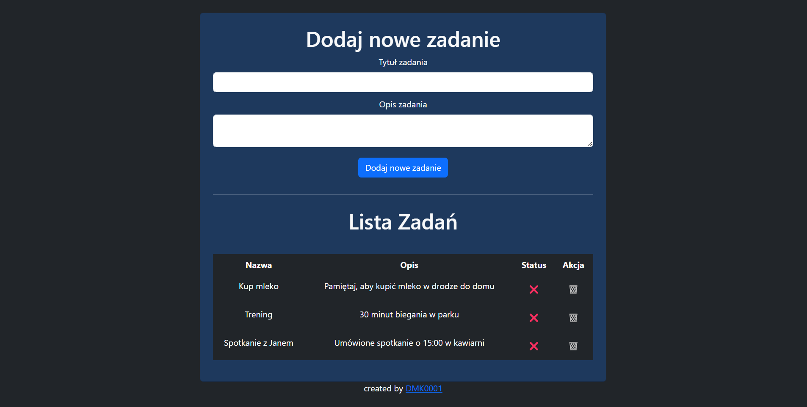

# To-Do List Application

This is a simple To-Do List application built with **Spring Boot**, **Thymeleaf**, and **JPA (Hibernate)**. The tasks are stored in an embedded H2 database.

## Features
- Add new tasks with a title and description.
- Mark tasks as completed or not completed (toggle status).
- Delete tasks.
- Basic responsive UI with **Bootstrap 5**.

## Screenshot
